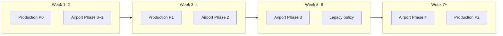

# Orienta v3 — Production & Multi-Airport Roadmap

> Created: 2026-06-07  
> Updated: 2026-06-07 — **PEK-only scope** (SFO airport demo removed)  
> Scope: `orienta_v3` standalone repo (`apps/dashboard` + `pdr_airchina`)  
> Companion docs: [`HARDCODED_VALUES.md`](./HARDCODED_VALUES.md), [`PASSENGER_PRODUCTION_WORKLOG.md`](./PASSENGER_PRODUCTION_WORKLOG.md), [`README.md`](./README.md)

---

## Product scope (2026-06)

**Supported hub:** PEK T3E only (`tenantId` default `airchina`).

**Removed:** SFO airport demo (`sfo.ts`, SFO CSV/video assets, dual-hub UI). Demo flight **CA7206 from San Francisco → PEK** remains as PEK transfer story data.

**Future airports:** add via config-driven `AirportRegistry` (see Part 2) — do not restore deleted SFO module.

---

## How to use this doc

- **Status** column: `todo` | `in-progress` | `done` | `wontfix`
- Checkboxes track sprint progress; update as you ship.
- Production and multi-airport work overlap — see [Unified timeline](#unified-timeline) for recommended order.

---

## Executive summary

**What we have:** Docker/Compose, passenger session JWTs, SQLite persistence (passengers, accounts, chat, audit), admin httpOnly cookies, rate limits, maintenance jobs, and production env flags (`PAX_LEGACY_AUTH`, `ORIENTA_ALLOW_DEMO`).

**What we lack for real production:** hardened auth boundaries, health/backup runbooks, live FIDS, CI/tests, observability, and a clear legacy-page strategy.

**Multi-airport gap:** Runtime is **multi-tenant** (`tenantId`) but not **multi-airport** (`airportId`). The codebase is now **PEK-only** (SFO demo removed). Adding a new hub requires the **Airport/Tenant Registry** (Part 2) — not copy-paste of old SFO branches.

**Recommended strategy:** Ship production P0 security/deploy items in parallel with **Airport/Tenant Registry** (Phase 0–1). Registry unlocks faster airport onboarding when needed.

---

## Current state snapshot

### Foundations already in place

| Area | Status | Key paths |
|------|--------|-----------|
| Env validation | ✅ | `apps/dashboard/server/config.ts` |
| Docker deploy | ✅ | `docker-compose.yml`, `apps/dashboard/Dockerfile`, `deploy.example.env` |
| Passenger sessions | ✅ | `server/routes/paxSessions.ts`, `server/passengers/paxSessionToken.ts` |
| Pax accounts (SQLite + scrypt) | ✅ partial | `server/passengers/PaxAccountStore.ts`, `server/lib/passwordHash.ts` |
| Admin cookie auth | ✅ | `server/routes/auth.ts`, `server/auth/adminAuth.ts` |
| WS auth | ✅ when flags set | `server/hub/wsHub.ts`, `server/passengers/paxWsIdentity.ts` |
| Chat persistence | ✅ | `server/hub/ChatRepository.ts`, `server/hub/HubStore.ts` |
| Rate limiting | ✅ in-memory | `server/middleware/rateLimit.ts`, `server/server.ts` |
| Audit log | ✅ partial | `server/lib/auditLog.ts` (admin login only) |
| Retention jobs | ✅ | `server/jobs/maintenance.ts` |
| PDR stack | ✅ | `pdr_airchina/`, `/pdr-api` proxy |

### Critical gaps (one line each)

| Gap | Impact |
|-----|--------|
| Legacy auth default **on** in dev `.env.example` | Easy to deploy with `PAX_LEGACY_AUTH=1` |
| Admin passwords **plaintext in env** | Not enterprise-ready |
| No **`GET /health`** | Docker/orchestrator can't probe app readiness |
| No **SQLite backup** runbook | Data loss on volume failure |
| **Hub state in memory** (presence, push subs, trajectories) | Lost on restart |
| **Static PEK flights** in session resolution | Wrong gates without live FIDS |
| **2 unit test files**, no CI | Regressions slip through |
| **`/api/metrics/events`** client with no server route | Dead telemetry |
| **React `fetch("/api/...")`** ignores sub-path deploy | Breaks under `/orienta` prefix |
| **Dashboard hardcoded** `PEK` + `airchina` | Blocks multi-airport ops console |
| **`route_site/index.html`** ~6500 lines PEK logic | Largest coupling surface |

---

## Part 1 — Production readiness

### P0 — Before go-live (1–2 weeks)

#### Security boundary

- [x] **P0-1** Set production env (copy from `deploy.example.env`):

```dotenv
JWT_SECRET=<strong-random>
PAX_LEGACY_AUTH=0
ORIENTA_ALLOW_DEMO=0
ADMIN_CREDENTIALS=<real-accounts>
```

- [x] **P0-2** Align dev templates: root `.env.example` and `apps/dashboard/.env.example` should warn or match production defaults.
- [x] **P0-3** Gate demo UX to dev only:
  - `src/components/LoginScreen.tsx` — pre-filled creds + hint text (now `import.meta.env.DEV`)
  - `src/app/App.tsx` — demo SSO button (hidden in prod build)
- [x] **P0-4** Chat entitlement via session `capabilities` only; `PEK_PREMIUM_IDS` deprecated and only reachable when `PAX_LEGACY_AUTH=1` (`server/auth/paxAuthPolicy.ts`).
- [x] **P0-5** Protect expensive ops routes — `/api/orienta/pek-merged-video` now strict-rate-limited (10/min/IP). *Note: used rate-limit, not `requireAdmin`, because the route is called by the passenger video page; full admin-gating waits on the legacy-page decision (P1-8).*
- [x] **P0-6** RBAC: added `requireRole(...)`; passenger create/update = `admin`/`ops`, delete = `admin` (`server/routes/auth.ts`, `server/routes/passengers.ts`).
- [x] **P0-7** Tourist-position CORS now scoped to `TOURIST_ALLOWED_ORIGINS` allowlist (empty = same-origin) instead of blanket `*` (`server/routes/push.ts`).

| Item | Files | Status |
|------|-------|--------|
| P0-1 env | `deploy.example.env` | done |
| P0-2 templates | `.env.example`, `apps/dashboard/.env.example` | done |
| P0-3 demo UX | `LoginScreen.tsx`, `App.tsx` | done |
| P0-4 capabilities | `paxAuthPolicy.ts`, `hub/chat.ts` | done |
| P0-5 merged-video auth | `server/server.ts`, `flight.ts` | done (rate-limit) |
| P0-6 RBAC | `server/routes/auth.ts`, `passengers.ts` | done |
| P0-7 CORS | `server/routes/push.ts`, `config.ts` | done |

#### Deploy & health

- [x] **P0-8** Added `GET /health` — process alive + SQLite ping, reports PDR / indoor-map mode; `200`/`503` (`server/server.ts`).
- [x] **P0-9** Docker `HEALTHCHECK` now hits `/health` (`apps/dashboard/Dockerfile`).
- [x] **P0-10** Documented indoor map topology (bundled vs external upstream) in `README.md`, `deploy.example.env`, `.env.example`.
- [x] **P0-11** Compose `orienta` now `depends_on: condition: service_healthy` for PDR (PDR already has a `/health` HEALTHCHECK).

| Item | Files | Status |
|------|-------|--------|
| P0-8 health endpoint | `server/server.ts`, `ChatRepository.ts` | done |
| P0-9 Docker health | `apps/dashboard/Dockerfile` | done |
| P0-10 map topology | `README.md`, `deploy.example.env` | done |
| P0-11 compose deps | `docker-compose.yml` | done |

#### Data & accounts

- [x] **P0-12** SQLite backup runbook (`sqlite3 .backup`, Docker volume, restore) documented in `README.md`.
- [~] **P0-13** Passenger accounts: admin CRUD beyond env seed — `GET/POST/DELETE /api/pax/accounts` (`PaxAccountStore.listAccounts/upsertAccount/deleteAccount`). *Still TODO: self-registration, password reset, lockout, IdP.*
- [x] **P0-14** Admin accounts: `ADMIN_CREDENTIALS` now supports scrypt hashes (`email:scrypt$…`); plaintext kept for dev. Helper: `scripts/hashAdminPassword.ts`. SSO still optional.

| Item | Files | Status |
|------|-------|--------|
| P0-12 backup | `README.md` | done |
| P0-13 pax accounts | `PaxAccountStore.ts`, `paxSessions.ts` | partial |
| P0-14 admin auth | `auth.ts`, `passwordHash.ts`, `scripts/` | done |

---

### P1 — First 30 days after launch

| Item | Description | Key files | Status |
|------|-------------|-----------|--------|
| **P1-1** CI pipeline | GitHub Actions: `build`, `build:server`, `test` on push/PR | `.github/workflows/ci.yml` | done |
| **P1-2** Test coverage | Added rate limit, BCBP parser, MetricsRepository suites (+existing geo, passwordHash) → 12 tests | `server/**/*.test.ts` | done (partial) |
| **P1-3** Structured logging | JSON logger + request-id middleware; `console.log` replaced | `lib/logger.ts`, `middleware/requestLog.ts`, `server.ts` | done |
| **P1-4** Expanded audit | Passenger CRUD, chat send, pax session create, account upsert/delete | `auditLog.ts`, `passengers.ts`, `paxSessions.ts`, `push.ts` | done |
| **P1-5** Metrics | Implemented `/api/metrics/events` ingestion → SQLite, rate-limited, pruned | `routes/metrics.ts`, `lib/MetricsRepository.ts`, `server.ts` | done |
| **P1-6** Graceful shutdown | SIGTERM/SIGINT closes WS clients, drains HTTP, 10s force-exit | `server/server.ts`, `hub/wsHub.ts` | done |
| **P1-7** Live FIDS | FlightAware drives session gate/schedule (5-min cache); static = fallback when no key / lookup fails | `services/flightAware.ts`, `services/fidsService.ts`, `paxSessions.ts` | done |
| **P1-8** Legacy page policy | React `/pax` + `/pax/app` canonical; push URL → `/pax/app`; legacy links gated to dev (legacy pages still reachable for old QR codes) | `push.ts`, `PaxEntryPage.tsx`, `PaxAppPage.tsx` | done |
| **P1-9** Sub-path deploy | `apiUrl()` / `wsUrl()` helpers; fixes WS + iframe under base path | `src/config/api.ts` (+ consumers) | done |
| **P1-10** Security headers | helmet (CSP/CO* off for legacy iframes) + `trust proxy` | `server/server.ts` | done |

---

### P2 — Medium term

| Item | Description | Status |
|------|-------------|--------|
| **P2-1** PostgreSQL option | Async `SqlDb` layer (`server/db/sqlDb.ts`) with sqlite + pg dialects; all repos migrated; `DATABASE_URL` switches to Postgres. Default stays SQLite | done |
| **P2-2** Push subscription persistence | `SqlDb`-backed (`PushSubscriptionStore`); survives restarts, prunes 404/410 endpoints | done |
| **P2-3** Shared rate limit / presence | Redis fan-out bus (`HubBus`) + shared presence set + Redis fixed-window rate limit (`REDIS_URL`); in-memory fallback. Verified across 2 instances | done |
| **P2-4** Video merge as job service | `requestMerge` enqueues to Redis; separate `pek_video_worker.py` container runs ffmpeg; non-blocking `spawn` fallback single-machine | done |
| **P2-5** Error tracking | Optional Sentry SDK (`@sentry/node` + `@sentry/react`); Express error handler, `unhandledRejection`/`uncaughtException` guards, flush on shutdown, browser `ErrorBoundary`; no-op + structured logs when `SENTRY_DSN`/`VITE_SENTRY_DSN` unset | done |

---

## Part 2 — Multi-airport extensibility (future)

> **Note:** SFO demo was removed (2026-06). This section describes how to add airports **when needed**, starting from a PEK-only codebase.

### Problem statement

There is **no canonical tenant ↔ airport map** in code yet. Today everything assumes **PEK / `airchina`**:

```
tenantId "airchina"  →  airport PEK (Dashboard, pax pages, route_site)
ROUTE_SITE_DEFAULT_TENANT env → "airchina" (server)
route_site forces __ROUTESITE_HUB__ = 'PEK' (non-PEK query params ignored)
```

Session JWT carries `tenantId` but **not** `airportId`.

### Target architecture: config-driven registry

```
apps/dashboard/src/config/
  airports/
    types.ts              # AirportDefinition, AirportId, PoiMode
    registry.ts           # getByIata("PEK"), register(...)
    pek.config.ts         # PEK definition (only hub today)
  tenants/
    registry.ts           # "airchina" → { airportId: "PEK", features }
  client.ts               # VITE_DEFAULT_AIRPORT, VITE_ORIENTA_TENANT
```

#### `AirportDefinition` (sketch)

```typescript
type AirportDefinition = {
  id: string;                    // "PEK"
  iata: string;
  icao?: string;
  terminals: { id: string; label: string }[];
  defaultTerminal: string;       // e.g. "T3E"

  poi: {
    mode: "indoor_api" | "static" | "none";
    terminalQuery?: string;
    parser: "pek_t3e" | "generic";
    staticGates?: Record<string, LatLng>;
    defaultCenter: LatLng;
    bbox?: Bbox;
  };

  demo?: {
    outboundFlights: ...;
    inboundFlights: ...;
    premiumPassengerIds?: Set<string>;
    defaultTransferGates?: { from: string; to: string };
    flightGateMap?: Record<string, string>;
  };

  routeSite?: {
    hubKey: string;
    configUrl: string;           // /route_site/config/pek.json
  };

  map: {
    indoorMapEnabled: boolean;
    gatePattern?: RegExp;
  };
};
```

#### Unified services (replace scattered if/else)

| Service | Replaces |
|---------|----------|
| `PoiService.loadGates(airportId)` | `pekPoiCoords.ts`, `poiCache.ts`, `gateService.ts`, SFO static coords |
| `FlightCatalogService.resolveOutbound(airportId, flightId)` | `paxSessions.ts` + `buildPekFlights()` |
| `TenantRegistry.resolve(tenantId)` | Dashboard, MapView, pax.html inference |
| `PassengerSource` strategy | PEK registry API vs SFO static demo |

#### API additions

- ✅ `GET /api/config/tenant/:tenantId` → `{ tenant, airport, terminals, defaults }` (Phase 5, `server/routes/config.ts`)
- ✅ `airportId` in pax session JWT claims (Phase 5, `airportForTenant(tenantId)`)
- ⬜ Generalize `/api/orienta/pek-merged-video` → `/api/orienta/:airportId/merged-video` (keep PEK alias)

#### `route_site` decoupling (largest coupling)

```
public/route_site/
  index.html              # thin shell (~200 lines)
  bootstrap.js            # ?hub= → load config
  config/pek.json         # route_site constants
```

---

### Multi-airport migration phases

| Phase | Scope | Effort | Risk | Status |
|-------|-------|--------|------|--------|
| **0** | Registry scaffold (`src/config/airports/{types,registry,pek.config}.ts`, `tenants/registry.ts`, `client.ts`); PEK entry reuses `data/airports/pek.ts`; `airportForTenant("airchina")→PEK`; no consumers wired (bundle unchanged) | 1–2 d | Low | done |
| **1** | `Dashboard.tsx` + `MapView.tsx` resolve airport/tenant via `config/client.ts` (`VITE_DEFAULT_AIRPORT`/`VITE_ORIENTA_TENANT`); POI `terminal` centralized (client → registry `terminalQuery`, server → `DEFAULT_TERMINAL` env); route_site hub already forced PEK. Behavior-preserving (PEK/T3E/airchina) | 1–2 d | Low | done |
| **2** | Server unified on registry: `fidsService.resolveOutbound(…, airportId)` + `paxSessions` pass `airportForTenant(tenantId)`; `flight.ts` dispatch via `getAirport().poi.mode`; `wsHub` nav gate map + `PassengerRegistry` spawn radius from registry. Behavior-preserving (PEK); guarded by `fidsService.test.ts` | 3–5 d | Med | done |
| **3** | `PoiService` (airport-aware facade, dispatches by `poi.mode`) with `pekPoiCoords` as the PEK adapter; `gateService` delegates; `MapView`/`PaxAppPage` rewired (drops hardcoded PEK center); `useDashboard` passenger source extracted to `passengerSource`. Guarded by `PoiService.test.ts` | 3–5 d | Med | done |
| **4** | Split `route_site/index.html` into config JSON + engines | 1–2 wk | High | todo |
| **5** | `GET /api/config/tenant/:tenantId` (`server/routes/config.ts`) returns tenant/airport/terminals/defaults (no demo data); pax session JWT now carries `airportId` (`airportForTenant(tenantId)`) + surfaced in `/api/pax/session`. Onboarding: see "Adding airport #3" | 2–3 d | Low | done |

### Adding airport #3 (target state — e.g. LHR)

1. Add `lhr.config.ts` to `AirportRegistry`.
2. Add tenant `british_airways` → `LHR` in `TenantRegistry`.
3. If indoor map exists: POI adapter + `route_site/config/lhr.json`.
4. Deploy: `VITE_ORIENTA_TENANT=british_airways`, `VITE_DEFAULT_AIRPORT=LHR`.
5. **No** new `if (airport === "LHR")` in `Dashboard.tsx`.

### File change index (multi-airport)

#### New files

| File | Purpose |
|------|---------|
| `src/config/airports/types.ts` | Core types |
| `src/config/airports/registry.ts` | Lookup |
| `src/config/airports/pek.config.ts` | PEK definition |
| `src/config/tenants/registry.ts` | Tenant → airport |
| `src/config/client.ts` | Vite env resolution |
| `src/services/poi/PoiService.ts` | Unified gates |
| `src/services/FlightCatalogService.ts` | Flights + resolveOutbound |
| `server/routes/config.ts` | Tenant config API |
| `public/route_site/config/pek.json` | Route site constants |

#### High-priority modifications

| File | Change |
|------|--------|
| `src/app/Dashboard.tsx` | Remove hardcoded PEK / airchina |
| `src/features/passengers/useDashboard.ts` | Passenger source from registry |
| `src/features/map/MapView.tsx` | Tenant from TenantRegistry |
| `server/routes/flight.ts` | Registry-based airport dispatch |
| `server/routes/paxSessions.ts` | `resolveOutbound(airportId, …)` |
| `server/passengers/PassengerRegistry.ts` | Airport-aware spawn bbox |
| `server/hub/wsHub.ts` | Airport-aware flightGateMap |
| `server/lib/poiCache.ts` | Multi-airport cache |
| `server/auth/paxAuthPolicy.ts` | Capabilities over static premium IDs |
| `src/services/gateService.ts` | Delegate to PoiService |
| `public/pax.html` | Tenant config instead of inline PEK/SFO |
| `public/route_site/index.html` | Phase 4: strip to shell |

See [`HARDCODED_VALUES.md`](./HARDCODED_VALUES.md) for the full hardcoded inventory and Phase A–D checklist.

---

## Unified timeline

Production and registry work should run in parallel:

```
Week 1–2   Production P0 (security, /health, backup, env alignment)
           + Airport Phase 0–1 (Registry scaffold + env wiring)

Week 3–4   Production P1 (CI, tests, audit, FIDS integration)
           + Airport Phase 2 (server unification)

Week 5–6   Airport Phase 3 (Dashboard + passenger sources)
           + Legacy page decision (route_site / pax.html in prod?)

Week 7+    Airport Phase 4 (route_site decomposition)
           + Production P2 as needed (Postgres, multi-instance)
```



---

## Known inconsistencies (fix early)

| Issue | Detail | Track in |
|-------|--------|----------|
| Session JWT | No `airportId` claim | Phase 5 |
| `route_site` canvas | Legacy pixel paths (`PPL_PATH`) still embedded in `index.html` | Phase 4 |
| CSV naming | `PEK_gate_timestamp_full_with_E24_E36.csv` vs shorter local CSV | ops |
| Metrics endpoint | ✅ Fixed (P1-5): `/api/metrics/events` now ingests to SQLite | done |

---

## Application surface map

### Production React paths (target)

| Route | Component | Role |
|-------|-----------|------|
| `/` | `Dashboard` | Operator console |
| `/pax` | `PaxEntryPage` | Session creation |
| `/pax/app` | `PaxAppPage` | Authenticated passenger app |

### Legacy static (review for prod)

| Asset | Notes |
|-------|-------|
| `public/pax.html` | Original shell; legacy auth path |
| `public/pax-flight.html`, `pax-route-video.html`, `pax-login.html` | Demo variants |
| `public/route_site/index.html` | ~6500 lines; PEK video/navigation demo |
| `public/orienta-base.js` | Sub-path helper (React lacks equivalent) |

---

## Related documentation

| Doc | Purpose |
|-----|---------|
| [`HARDCODED_VALUES.md`](./HARDCODED_VALUES.md) | Hardcoded value audit + refactor checklist |
| [`PASSENGER_PRODUCTION_WORKLOG.md`](./PASSENGER_PRODUCTION_WORKLOG.md) | Passenger auth implementation log |
| [`CODEBASE.md`](./CODEBASE.md) | v2→v3 refactor overview |
| [`README.md`](./README.md) | Dev setup and security env |
| [`deploy.example.env`](./deploy.example.env) | Production Docker env template |

---

*Update checkboxes and Status fields as work completes.*
